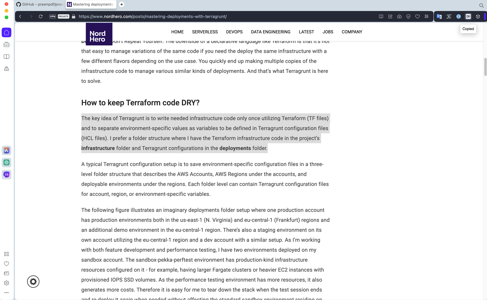
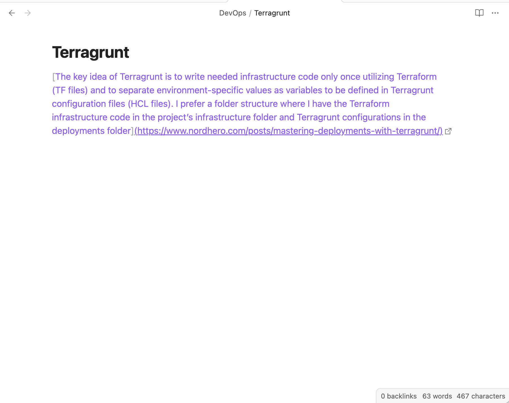

# Selection to Markdown Link

Chrome extension to copy selection and a link in Markdown.

Copied:

Pasted:

## Installation

Install from Chrome Web Store:

## Usage

### Copy

Click the extension icon or press the keyboard shortcut to copy link in Markdown format.
Select the text before copying to change the tab title in the link to the selected text instead.

### Keyboard shortcut

The default keyboard shortcut is <kbd>Ctrl + Shift + C</kbd> (<kbd>Cmd + Shift + C</kbd> for macOS).
This can be changed from the browser's extension settings.
